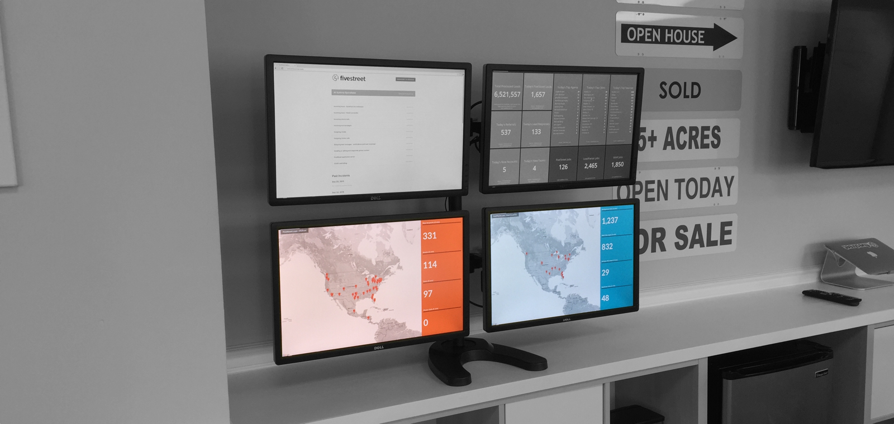
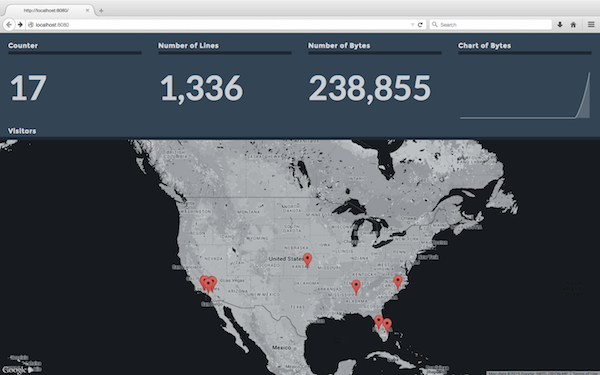

# Dasht

Dasht is a framework for building beautiful, developer-focused application dashboards. Dasht is especially good at displaying high-level application stats in real-time on a wall-mounted monitor.

> "You can't manage what you don't measure." - Peter Drucker

Dasht works best with a Twelve-Factor (Heroku style) app. Specifically, your app should treat [logs as event streams](http://12factor.net/logs). Dasht lets you detect events with regular expressions, turn the events into metrics, then publish the metrics to a dashboard.

A typical Dasht dashboard takes just a few minutes of coding and is usually less than 100 lines of Ruby.

Dasht is a Ruby / Rack application by [Rusty Klophaus](http://rusty.io), open-sourced under the MIT license.

[](http://badge.fury.io/rb/dasht)


*Two Dasht-powered dashboards at FiveStreet HQ*

# Getting Started

Let's make the following dashboard for your Heroku app.



First, copy the Ruby code below to a file called `my_dashboard.rb`.

```ruby
require 'dasht'

application = ARGV[0]

dasht do |d|
  # Consume Heroku logs.
  d.start "heroku logs --tail --app #{application}" do |l|
    # Track some metrics.
    l.count :lines, /.+/

    l.count :bytes, /.+/ do |match|
      match[0].length
    end

    l.append :visitors, /Started GET .* for (\d+\.\d+\.\d+\.\d+) at/ do |matches|
      matches[1]
    end
  end

  counter = 0
  d.interval :counter do
    sleep 1
    counter += 1
  end

  # Publish a board.
  d.board do |b|
    b.value :counter,  :title => "Counter"
    b.value :lines,    :title => "Number of Lines"
    b.value :bytes,    :title => "Number of Bytes"
    b.chart :bytes,    :title => "Chart of Bytes", :periods => 10
    b.map   :visitors, :title => "Visitors", :width => 12, :height => 9
  end
end
```

Then, run the following commands in your shell:

```sh
# Install the gem.
gem install dasht

# Create a dashboard.
vi my_dashboard.rb

# Run the dashboard.
ruby my_dashboard.rb $APPNAME

# Open the dashboard.
open http://localhost:8080
```

Look in the [examples](https://github.com/rustyio/dasht/tree/master/examples) folder for more example dashboards..

# Documentation

## Creating a Dasht Instance

To create a Dasht instance, simply require the library and then call the global `dasht` method with a block.

```ruby
require 'dasht'

dasht do |d|
  # ...Your metrics and dashboards...
end
```

There are a number of global settings that can be specified at the instance level, with their corresponding defaults:

```ruby
dasht do |d|
  # Set the web port.
  b.port = 8080

  # Set the amount of history to keep.
  b.history = 60 * 60

  # Set a background color.
  b.background = "#334455"

  # Or, set a background image.
  # b.background = "url(http://path/to/image.png)"

  # Set the default resolution.
  b.default_resolution = 60

  # Set the default refresh rate.
  b.default_refresh = 5

  # Set the default tile width.
  b.default_width = 3

  # Set the default tile height.
  b.default_height = 3

  # Set the default number of periods.
  b.default_periods

  # ...Your metrics and dashboards...
end
```


## Ingesting Data

Dasht gets data by running a command (or tailing a log file) and listening to the output. A single Dasht instance can listen to multiple sources. If the command ends for some reason, it is automatically restarted.

Some examples:

```ruby
# Start a command, process the output.
d.start("heroku logs --tail --app my_application") do |l|
  ...
end

# Tail a file, process the new data.
d.tail("/path/to/my_application.log") do |l|
  ...
end
```

There is also an interval type meant for querying external data sources. It simply runs in a loop. Remember to include a `sleep` statement!.

```ruby
# Query external data. Acts as a gauge, and sets the metric to the
# return value of the block.
d.interval :my_metric do
  sleep 5
  hash = JSON.parse(Net::HTTP.get("http://website/some/api.json"))
  hash["value"]
end
```

## Metrics

Dasht tries to apply each new log line against a series of user-defined regular expressions. When a regular expression matches, Dasht updates the corresponding metric.

There are a number of pre-defined metric types:

+ `gauge` - Set a metric.
+ `count` - Increment a metric by some amount. (defaults to 1 if no block is provided).
+ `min` - Update the minimum value.
+ `max` - Update the maximum value.
+ `append` - Create a list of values. Useful for non-numeric data such as geographic locations.

Unless otherwise noted, all metric definitions require a block. The block should convert the regular expression match into a value. Metrics should be kept as simple and compact as possible to keep memory requirements low. (Dasht uses an extremely simple structure to store time-series data. It doesn't go to great lengths to be especially resource efficient.)

Some examples:

```ruby
d.start "some command" do |l|
  # Track the total number of log lines processed.
  l.count :lines, /.+/

  # Track the total size of the logs, in bytes.
  l.count :bytes, /.+/ do |match|
    match[0].length
  end

  # Track the maximum response time.
  l.max :max_response, /Completed 200 OK in (\d+)ms/ do |match|
    match[1].to_i
  end

  # Track visitor IP addresses.
  l.append :visitors, /Started GET .* for (\d+\.\d+\.\d+\.\d+) at/ do |matches|
    matches[1]
  end
end
```

You can also define your own metric types with the `event` command. The `op` parameter is a symbol referring to any [Array](http://ruby-doc.org/core-2.2.0/Array.html) instance method. If the built-in Array methods don't do what you need, you can monkey-patch the array class to add new methods.

```ruby
# Format is d.event(metric, regex, op, &block). The definition below
# would set the metric to the first occurance of some metric value
# for a given timeframe.
l.event(:my_metric, /some-regex/, :first) do |match|
  match[1].to_i
end
```

## Boards

A single Dasht instance can host multiple dashboards. Dashboards are defined like this:

```ruby
# Publish a board, accessible through "/boards/my_board"
d.board :my_board do |b|
  ...
end

# Publish the default board, accessible through "/"
d.board do |b|
  ...
end
```

Each dashboard can have a number of different settings, documented below with their corresponding defaults:

```ruby
d.board do |b|
  # Set a background color.
  b.background = "#334455"

  # Or, set a background image.
  # b.background = "url(http://path/to/image.png)"

  # Set the default resolution.
  b.default_resolution = 60

  # Set the default refresh rate.
  b.default_refresh = 5

  # Set the default tile width.
  b.default_width = 3

  # Set the default tile height.
  b.default_height = 3

  # Set the default number of periods.
  b.default_periods
end
```
Each dashboard can be filled with tiles that display various key metrics about the app. Each dashboard is split into a 12x12 grid. Tiles by default take up a 3x3 spot. The height and width of each tile can be adjusted with a per-tile setting.

Dasht tries to make dashboards look nice with minimal effort in the following ways:

+ The dashboard itself gracefully stretches to fill the entire screen for most reasonable monitor sizes, even in portrait orientation.
+ Tile elements are designed to be slightly transparent, so they look nice with any background color or image.
+ Text is automatically scaled up or down to be as large as possible while still fitting into available space.
+ Dasht is responsive and looks nice on mobile devices and tables. That said, the target platform is a large monitor.

## Tiles

Metrics can be published by placing tiles on a dashboard. Dasht comes with a handful of tile types.

All tiles respond to the following options:

+ `:title` - The title of the tile.
+ `:resolution` - The resolution of the tile. Defaults to the board or instance default. If none specified, defaults to 60, meaning that it will load data for the last minute.
+ `:refresh` - The refresh rate of the tile. Defaults to the board or instance default. If none specified, defaults to 5, meaning that it will load fresh data every 5 seconds.
+ `:width` - The width of the tile, an integer from 1 to 12. Defaults to 3.
+ `:height` - The height of the tile, an integer from 1 to 12. Defaults to 3.

Individual tiles have additional attributes.

Dasht is extensible. New tiles are relatively easy to write. A simple tile plugin takes around 30 lines of Javascript. See the [existing plugins](https://github.com/rustyio/dasht/tree/master/assets/plugins) for examples.

### Value Tile

Display a single numeric value.

```ruby
b.value :my_metric, :title => "My Title"
```

### Map Tile

Drop pins on a map corresponding to either a physical addresses ("123 Main Street..."), an IP address ("216.58.217.142"), or coordinates ("[-97.7559964, 30.3071816]", longitude then latitude) . The metric attached to the map should use the `append` metric type, and the block should return the address string. See `examples/simple_heroku_dashboard.rb` for an example.

```ruby
b.map :visitors, :title => "Visitors"
```

### Chart Tile

Show a simple line chart of the metric. This will display the value of the metric for a number of periods in history. For example, if the resolution is 60, and periods is set to 10, then the chart will show the last rolling 10 minutes of history.

```ruby
b.chart :my_metric, :title => "My Title", :periods => 10
```

### A Tile With Many Settings

Here is how other settings are set.

```ruby
b.value :my_metric, :title => "My Title",
        :resolution => 10, :refresh => 1, :width => 6, :height => 2
```

# Contributing

To contribute, please create a pull request with a good description and either a unit test or a sample dashboard that exercises the new feature.

# License

The MIT License (MIT)

Copyright (c) 2015 Rusty Klophaus

Permission is hereby granted, free of charge, to any person obtaining a copy of this software and associated documentation files (the "Software"), to deal in the Software without restriction, including without limitation the rights to use, copy, modify, merge, publish, distribute, sublicense, and/or sell copies of the Software, and to permit persons to whom the Software is furnished to do so, subject to the following conditions:

The above copyright notice and this permission notice shall be included in all copies or substantial portions of the Software.

THE SOFTWARE IS PROVIDED "AS IS", WITHOUT WARRANTY OF ANY KIND, EXPRESS OR IMPLIED, INCLUDING BUT NOT LIMITED TO THE WARRANTIES OF MERCHANTABILITY, FITNESS FOR A PARTICULAR PURPOSE AND NONINFRINGEMENT. IN NO EVENT SHALL THE AUTHORS OR COPYRIGHT HOLDERS BE LIABLE FOR ANY CLAIM, DAMAGES OR OTHER LIABILITY, WHETHER IN AN ACTION OF CONTRACT, TORT OR OTHERWISE, ARISING FROM, OUT OF OR IN CONNECTION WITH THE SOFTWARE OR THE USE OR OTHER DEALINGS IN THE SOFTWARE.
