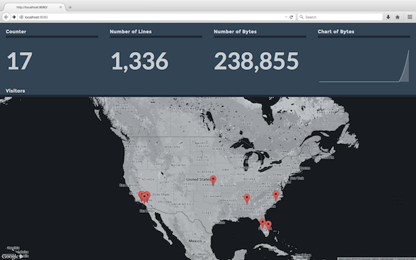

# Dasht

Dasht is a framework for building beautiful, developer-focused application dashboards. Dasht is especially good at displaying high-level application stats in real-time on a wall-mounted monitor.

Dasht works best with a Twelve-Factor (Heroku style) app. Specifically, your app should treat [logs as streams](http://12factor.net/logs). Dasht gathers data from log streams using a regular expression, aggregates the data in a very simple in-memory time series database, then publishes the data (or some form of the data) to tiles on a dashboard.

A typical Dasht dashboard takes just a few minutes of coding and is usually less than 100 lines of Ruby.

Dasht is a Ruby / Rack application by [Rusty Klophaus](http://rusty.io), open-sourced under the MIT license.

# Getting Started

Let's make the following dashboard for your Heroku app.



First, copy the Ruby code below to a file called `my_dashboard.rb`.

```ruby
require 'dasht'

application = ARGV[0]

dasht do |d|
  # Consume Heroku logs.
  d.start "heroku logs --tail --app #{application}"

  # Track some metrics.
  d.count :lines, /.+/

  d.count :bytes, /.+/ do |match|
    match[0].length
  end

  d.append :visitors, /for (\d+\.\d+\.\d+\.\d+) at/ do |matches|
    matches[1]
  end

  counter = 0
  d.interval :counter do
    sleep 1
    counter += 1
  end

  # Publish a board.
  d.board do |b|
    b.metric :counter,  :title => "Counter"
    b.metric :lines,    :title => "Number of Lines"
    b.metric :bytes,    :title => "Number of Bytes"
    b.chart  :bytes,    :title => "Chart of Bytes", :periods => 10
    b.map    :visitors, :title => "Visitors", :width => 12, :height => 9
  end
end
```

Then, run the following commands in your shell:

```sh
# Install the gem.
gem install dasht

# Create a dashboard.
vi my_dashboard.rb

# Run the dashboard.
ruby my_dashboard.rb $APPNAME

# Open the dashboard.
open http://localhost:8080
```

Look in **examples** folder for more example dashboards..

# Documentation

## Injesting Data

Dasht gets data by running a command (or tailing a log file) and listening to the output. A single Dasht instance can listen to multiple sources. If the command ends for some reason, it is automatically restarted.

Some examples:

```ruby
# Start a command, process the output.
d.start("heroku logs --tail --app my_application")

# Tail a file, process the new data.
d.tail("/path/to/my_application.log")
```

## Measures

Dasht tries to apply each new log line against a series of user-defined regular expressions. When a regular expression matches, the measure is updated based on the measure type..

There are a number of pre-defined measure types:

+ `gauge` - Set a measure.
+ `count` - Increment a measure by some amount. (defaults to 1 if no block is provided).
+ `min` - Update the minimum value.
+ `max` - Update the maximum value.
+ `append` - Create a list of values. Useful for non-numeric data such as geographic locations.

Unless otherwise noted, all measure definitions require a block. The block should convert the regular expression match into a value. Measures should be kept as simple and compact as possible to keep memory requirements low.

Some examples:

```ruby
# Track the total number of log lines processed.
d.count :lines, /.+/

# Track the total size of the logs, in bytes.
d.count :bytes, /.+/ do |match|
  match[0].length
end

# Track the maximum response time.
d.max :max_response, /Completed 200 OK in (\d+)ms/ do |match|
  match[1].to_i
end

# Track visitor IP addresses.
d.append :visitors, /Started GET .* for (\d+\.\d+\.\d+\.\d+) at/ do |matches|
  matches[1]
end
```

You can also define your own measure types with the `event` command. The `op` parameter is any Array instance method. Money patching can come in handy if the built-in Array methods don't do what you need.

```ruby
# Format is d.event(metric, regex, op, &block). The definition below
# would set the measure to the first occurance of some measure value
# for a given timeframe.
d.event(:my_metric, /some-regex/, :first) do |match|
  match[1].to_i
end
```

Dasht has one more measure type, an interval type meant for querying external data sources on a regular schedule.

```ruby
# Query external data. Acts as a gauge, and sets the measure to the
# return value of the block.
d.interval :my_metric do
  sleep 5
  hash = JSON.parse(Net::HTTP.get("http://website/some/api.json"))
  hash["value"]
end
```

## Boards

A single Dasht instance can host multiple dashboards. Dashboards are defined like this:

```ruby
# Publish a board, accessible through "/boards/my_board"
d.board :my_board do |b|
  ...
end

# Publish the default board, accessible through "/"
d.board do |b|
  ...
end
```

Each dashboard can have a number of different settings, documented below:

```ruby
d.board do |b|
  # Set the background color.
  b.background = "darkorange"

  # Set a background image.
  b.background = "url(http://path/to/image.png)"

  # Set the default resolution.
  b.default_resolution = 60

  # Set the default refresh rate.
  b.default_refresh = 5

  # Set the default tile width.
  b.default_width = 3

  # Set the default tile height.
  b.default_height = 3

  # Set the default number of periods.
  b.default_periods
end
```
Each dashboard can be filled with tiles that display various key metrics about the app. Each dashboard is split into a 12x12 grid. Tiles by default take up a 3x3 spot. This can be adjusted through a per-tile setting.

On the browser side, Dasht tries to make dashboards look nice with minimal effort in the following ways:

+ The dashboard itself stretches to fill a full screen for most reasonable monitor sizes, even in portrait orientation.
+ Many tile elements are slightly transparent, so they look nice with any background color or image.
+ Dasht uses [Masonry](http://masonry.desandro.com/) to pack tiles into a reasonably compact and visually pleasing layout.
+ Text is automatically scaled up or down to be as large as possible while still fitting into available space.
+ Dasht is responsive and looks nice on mobile devices and tables. That said, the target platform is a large monitor.

## Tiles

Dasht comes with three types of tiles:

###

### Custom Tiles

Dasht is also extensible. It ships with three types of plugins ('metric', 'chart, and 'map') that are suitable for most uses. New plugins are fairly easy to write. A simple plugin takes around 30 lines of Javascript.

## Other Settings


# TODO

+ DONE - Fix responsiveness.
+ DONE - Fix exception logging.
+ DONE - Automatically reduce font for value fields.
+ DONE - Count up with more resource efficiency.
+ DONE - Rename value to metric.
+ DONE - Convert plugins to Dasht namespace.
+ DONE - Custom map css.
+ DONE - Update map to look up by things other than email address.
+ DONE - Change layout to 12 * 12 grid.
+ DONE - Convert map to do IP lookups on client side.
+ DONE - Support for reading multiple groups of data.
+ DONE - Load data right away, don't wait.
+ DONE - Cache IP lookups.
+ DONE - Create a CSS class that causes an element to fill available height.
+ DONE - Chart type tile.
+ DONE - Board level settings for resolution and refresh.
+ DONE - Board level settings for element size.
+ DONE - Interval types.
+ DONE - Simplify metric update.


+ Rename periods to periods.
+ Read data in batches to reduce browser resource usage.
+ Change dashboard color.
+ Load user defined plugins.
+ Remove points from the map.
+ Clear out old stats to free memory.
+ Fix up 'scroll' tile.
+ Create a 'delta' tile. (Up / down X percent.)

+ Blog post
